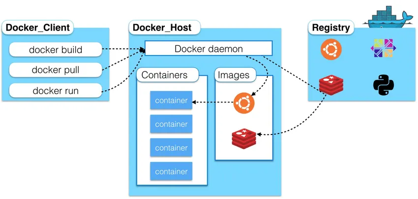
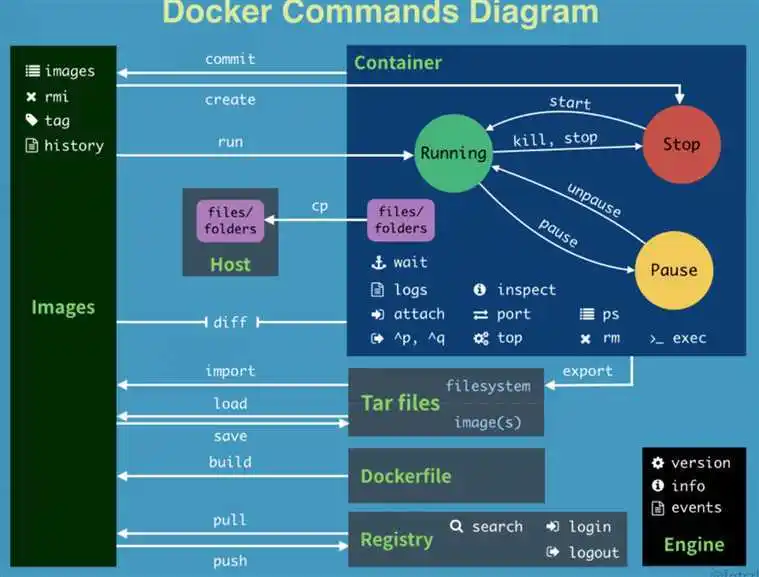

# docker

## 一、docker的安装

###  1. docker的基本结构



**image(镜像)**： 

docker镜像就好比是一个目标，可以通过这个目标来创建容器服务，tomcat镜像==>run==>容器（提

供服务器），**通过这个镜像可以创建多个容器**（最终服务运行或者项目运行就是在容器中的）。

**container(容器)**:

Docker利用容器技术，独立运行一个或者一组应用，通过镜像来创建的.

启动，停止，删除，基本命令

**repository(仓库)**:

仓库就是存放镜像的地方！

仓库分为公有仓库和私有仓库。(很类似git)

Docker Hub是国外的。

阿里云…都有容器服务器(配置镜像加速!)

### 2.  安装

准备

CentOS7及以上

```
帮助文档：https://docs.docker.com/engine/install/
```

安装

```shell
#1.卸载旧版本
yum remove docker \
	docker-client \
	docker-client-latest \
	docker-common \
	docker-latest \
	docker-latest-logrotate \
	docker-logrotate \
	docker-engine
#2.需要的安装包
yum install -y yum-utils
#3.设置镜像的仓库
yum-config-manager \
	--add-repo \
	https://download.docker.com/linux/centos/docker-ce.repo
#默认是从国外的（docker官网），不推荐
#推荐使用国内的（阿里云）
yum-config-manager \
	--add-repo \
	https://mirrors.aliyun.com/docker-ce/linux/centos/docker-ce.repo
#更新yum软件包索引
yum makecache fast
#4.安装docker相关的 docker-ce 社区版 而ee是企业版
yum install docker-ce docker-ce-cli containerd.io
#6. 使用docker version查看是否按照成功
docker version
#7. 启动docker daemon(docker的服务端后台程序)
systemctl start docker
#8. 测试
docker run hello-world
```

安装出现的问题

```shell
docker run hello-world
# docker run 可能出现下面错误
# Error while creating filesystem xfs on device docker-253:0-1052028-base: exit status 1  storage-driver=devicemapper

# 这是因为XFS文件系统管理工具的版本太低，使用如下命令升级：
yum update xfsprogs -y
```

### 3. 底层原理

-  **Docker是怎么工作的**？

Docker是一个Client-Server结构的系统，Docker的守护进程运行在主机上。通过Socket从客户端访问！

Docker-Server接收到Docker-Client的指令，就会执行这个命令！

 ## 二、Docker的常用命令

### 1. 帮助命令

```shell
docker version #显示docker的版本信息。
docker info #显示docker的系统信息，包括镜像和容器的数量
docker 命令 --help #帮助命令
#帮助文档的地址：https://docs.docker.com/engine/reference/commandline/build/
```

### 2. 镜像命令

```shell
docker images #查看所有本地主机上的镜像 可以使用docker image ls代替
docker search #搜索镜像
docker pull #下载镜像 docker image pull
docker rmi #删除镜像 docker image rm
```

**docker images **查看所有本地的主机上的镜像

```shell
docker images
REPOSITORY TAG IMAGE ID CREATED       SIZE
mysql 5.7 e73346bdf465 24 hours ago   448MB
# 解释
#REPOSITORY # 镜像的仓库源
#TAG # 镜像的标签
#IMAGE ID # 镜像的id
#CREATED # 镜像的创建时间
#SIZE # 镜像的大小
# 可选项
Options:
	-a, --all Show all images (default hides intermediate images) #列出所有镜像
	-q, --quiet Only show numeric IDs # 只显示镜像的id
```

**docker pull** 下载镜像

```shell
# 下载镜像 docker pull 镜像名[:tag]
➜ ~ docker pull tomcat:8
8: Pulling from library/tomcat 	#如果不写tag，默认就是latest
90fe46dd8199: Already exists 	#分层下载： docker image 的核心 联合文件系统（重点）
35a4f1977689: Already exists
bbc37f14aded: Already exists
74e27dc593d4: Already exists
93a01fbfad7f: Already exists
1478df405869: Pull complete
64f0dd11682b: Pull complete
68ff4e050d11: Pull complete
f576086003cf: Pull complete
3b72593ce10e: Pull complete
Digest: sha256:0c6234e7ec9d10ab32c06423ab829b32e3183ba5bf2620ee66de866df640a027
# 签名 防伪
Status: Downloaded newer image for tomcat:8
docker.io/library/tomcat:8 #真实地址
#等价于
docker pull tomcat:8
docker pull docker.io/library/tomcat:8
```

**docker rmi** **删除镜像**

```shell
➜ ~ docker rmi -f 镜像id 						#删除指定的镜像
➜ ~ docker rmi -f 镜像id 镜像id 镜像id 镜像id  	#删除指定的镜像
➜ ~ docker rmi -f $(docker images -aq) 		 #删除全部的镜像
```

### 3.容器命令

```shell
docker run 镜像id 		# 新建容器并启动
docker ps 				 # 列出所有运行的容器 docker container list
docker rm 容器id 			# 删除指定容器
docker start 容器id 		#启动容器
docker restart容器id 		#重启容器
docker stop 容器id 		#停止当前正在运行的容器
docker kill 容器id 		#强制停止当前容器
```

**新建容器并启动**

```shell
docker run [可选参数] image | docker container run [可选参数] image
#参书说明
--name="Name" 容器名字 tomcat01 tomcat02 用来区分容器
-d 后台方式运行
-it 使用交互方式运行，进入容器查看内容
-p 指定容器的端口 
	-p 8080(宿主机):8080(容器)
	-p ip:主机端口:容器端口
	-p 主机端口:容器端口(常用)
	-p 容器端口
-P(大写) 随机指定端口
```

**列出所有运行的容器**

```shell
#docker ps命令 #列出当前正在运行的容器
-a, --all Show all containers (default shows just running)
-n, --last int Show n last created containers (includes all states) (default -1)
-q, --quiet Only display numeric IDs
```

**退出容器**

```shell
# 在容器内部执行
exit #容器直接退出
ctrl +P +Q #容器不停止退出
```

**删除容器**

```shell
docker rm 容器id #删除指定的容器，不能删除正在运行的容器，如果要强制删除 rm -rf
docker rm -f $(docker ps -aq) #删除指定的容器
docker ps -a -q|xargs docker rm #删除所有的容器
```

**启动和停止容器的操作**

```shell
docker start 容器id 	#启动容器
docker restart 容器id #重启容器
docker stop 容器id 	#停止当前正在运行的容器
docker kill 容器id 	#强制停止当前容器
```

###  4.常用其他命令

**后台启动命令**

```shell
# 命令 docker run -d 镜像名
➜ ~ docker run -d centos
a8f922c255859622ac45ce3a535b7a0e8253329be4756ed6e32265d2dd2fac6c
➜ ~ docker ps
CONTAINER ID IMAGE COMMAND CREATED
STATUS PORTS NAMES
# 问题docker ps. 发现centos 停止了
# 常见的坑，docker容器使用后台运行，就必须要有要一个前台进程，docker发现没有应用，就会自动停止
# nginx，容器启动后，发现自己没有提供服务，就会立刻停止，就是没有程序了
```

**查看日志**

```shell
docker logs --help
Options:
--details Show extra details provided to logs
* -f, --follow Follow log output
--since string Show logs since timestamp (e.g. 2013-01-02T13:23:37) or
relative (e.g. 42m for 42 minutes)
* --tail string Number of lines to show from the end of the logs
(default "all")
* -t, --timestamps Show timestamps
--until string Show logs before a timestamp (e.g. 2013-01-02T13:23:37)
or relative (e.g. 42m for 42 minutes)

#显示日志
-tf #显示日志信息（一直更新）
--tail number #需要显示日志条数
```

**查看容器中进程信息** 

```bash
docker top 容器id
```

**查看镜像的元数据**

```shell
docker inspect 容器id
```

**进入当前正在运行的容器**

```shell
# 方式一： 打开伪终端进入正在进行的容器。
# 使用方式一进入容器后，执行exit，并不会影响容器的运行。（因为进入后的终端与容器本身的终端是不同的两个终端中）
docker exec -it 容器id /bin/bash

# 方式二: 绑定当前的输入、输出、错误输出流到正在运行的容器
# 使用方式二，执行exit后，容器会停止运行。（因为它们是同一个终端）
# 执行Ctrl +P +Q 则可以退出容器的同时，可以继续运行。
docker attach 容器id
```

**从容器内拷贝到主机上**

```shell
docker cp 容器id:容器内路径 宿主机目标路径
# 测试
docker cp 55321bcae33d:/java.java /home
```

### 5. 小结

Docker所有命令



## 三、Docker镜像讲解

**镜像是什么**

```
镜像是一种轻量级、可执行的独立软件保，用来打包软件运行环境和基于运行环境开发的软件，他包含运行某
个软件所需的所有内容，包括**代码、运行时库、环境变量和配置文件**。
将所有的应用和环境，直接打包为docker镜像，就可以直接运行。
```

### 1.Docker镜像加载原理

- **UnionFs （联合文件系统）**

```
UnionFs（联合文件系统）：Union文件系统（UnionFs）是一种分层、轻量级并且高性能的文件系统，他支
持对文件系统的修改作为一次提交来一层层的叠加，同时可以将不同目录挂载到同一个虚拟文件系统下（
unite several directories into a single virtual filesystem)。Union文件系统是
Docker镜像的基础。镜像可以通过分层来进行继承，基于基础镜像（没有父镜像），可以制作各种具体的应
用镜像。
**特性**：一次同时加载多个文件系统，但从外面看起来，只能看到一个文件系统，联合加载会把各层文件系
统叠加起来，这样最终的文件系统会包含所有底层的文件和目录。
```

- **Docker镜像加载原理**

```
docker的镜像实际上由一层一层的文件系统组成，这种层级的文件系统UnionFS。
```

### 2. 分层理解

我们可以去下载一个镜像，注意观察下载的日志输出，可以看到是一层层的在下载 。

查看镜像分层的方式可以通过**docker image inspect** 命令

```shell
docker image inspect [OPTIONS] IMAGE [IMAGE...]
# 例子
# docker image inspect redis:5.0
# 分层信息就在: "RootFS" -> "Layers" 
```

**所有的 Docker镜像都起始于一个基础镜像层，当进行修改或培加新的内容时，就会在当前镜像层之上，创建新的镜像层。**

### 3. commit镜像

```shell
docker commit -m="描述信息" -a="作者" 容器id 目标镜像名:[TAG]
# 例子
# docker commit -m="add script" -a="author" 
```

## 四、容器数据卷

### 1. 什么是容器卷？

容器之间可以有一个数据共享的技术！Docker容器中产生的数据，同步到本地！

数据卷其实就是建立宿主机目录到容器目录的映射

### 2. 使用数据卷

- 直接使用命令挂载 -v

```shell
docker run -it -v 主机目录:容器内目录 -p 主机端口:容器内端口
# 查看容器的目录映射(Mounts项)
# docker inspect 容器id
```

### 3.实战：安装MySQL

```shell
docker run --name some-mysql -e MYSQL_ROOT_PASSWORD=my-secret-pw -d mysql:tag
# 参数
#启动我们得
-d 后台运行
-p 端口映射
-v 卷挂载
-e 环境配置
-- name 容器名字

# 例子
docker run -d -p 3306:3306 -v /home/mysql/conf:/etc/mysql/conf.d -v /home/mysql/data:/var/lib/mysql -e MYSQL_ROOT_PASSWORD=123456 --name mysql01 mysql:5.7
```

### 4. 具名挂载和匿名挂载

```shell
# 三种挂载： 匿名挂载、具名挂载、指定路径挂载
-v 容器内路径 			   #匿名挂载
-v 卷名：容器内路径 		 #具名挂载
-v /宿主机路径：容器内路径    #指定路径挂载 docker volume ls 是查看不到的
```

拓展：

```shell
# 通过 -v 容器内路径： ro rw 改变读写权限
ro #readonly 只读
rw #readwrite 可读可写
docker run -d -P --name nginx05 -v juming:/etc/nginx:ro nginx
docker run -d -P --name nginx05 -v juming:/etc/nginx:rw nginx
```

**查看挂载的卷信息**

```shell
# 查看所有卷
docker volume ls

# 查看某一个卷的挂载信息
docker volume inspect 卷名    # 例子： docker volume inspect juming
```

所有的docker容器内的卷，没有指定目录的情况下都是在 /var/lib/docker/volumes/xxxx/_data

### 5.初识Dockerfile

Dockerfile 就是用来构建docker镜像的构建文件！

```shell
# 创建一个dockerfile文件，名字可以随便 建议Dockerfile
# 文件中的内容 指令(大写) 参数
FROM centos
VOLUME ["volume01","volume02"]		# Dockerfile中指定的匿名数据卷
CMD echo "----end----"
CMD /bin/bash
#这里的每个命令，就是镜像的一层！
```

### 6.容器数据卷

```shell
# docker run时的参数。共享父容器的数据卷。
--volumes-from list Mount volumes from the specified container(s)

# 例子
docker run -d -p 3307:3306 -e MYSQL_ROOT_PASSWORD=123456 --name
mysql02 --volumes-from mysql01 mysql:5.7
```

**结论**

容器之间的配置信息的传递，数据卷容器的生命周期一直持续到没有容器使用为止。

但是一旦你持久化到了本地，这个时候，本地的数据是不会删除的！

## 五、DockerFile

### 1. DockerFile介绍

dockerfile 是用来构建docker镜像的文件！命令参数脚本！

```shell
构建步骤：
1、 编写一个dockerfile文件
2、 docker build 构建称为一个镜像
3、 docker run运行镜像
4、 docker push发布镜像（DockerHub 、阿里云仓库)
```

### 2.DockerFile构建过程

**基础知识：**

1、每个保留关键字(指令）都是必须是**大写字母**

2、执行从上到下顺序

3、# 表示注释

4、每一个指令都会创建提交一个新的镜像层，并提交！

```shell
# DockerFile常用指令
FROM 			# 基础镜像，一切从这里开始构建
MAINTAINER 		# 镜像是谁写的， 姓名+邮箱 ### 现在已经不用MAINTAINER，改用LABEL
LABEL 			# LABEL <key>=<value> <key>=<value> <key>=<value> ...
RUN 			# 镜像构建的时候需要运行的命令
ADD 			# 添加文件或目录（针对压缩包，它会自动解压）
WORKDIR 		# 镜像的工作目录
VOLUME 			# 挂载的目录
EXPOSE 			# 保留端口配置
CMD 			# 指定这个容器启动的时候要运行的命令，只有最后一个会生效，可被替代。
ENTRYPOINT 		# 指定这个容器启动的时候要运行的命令，可以追加命令
ONBUILD 		# 当构建一个被继承 DockerFile 这个时候就会运行ONBUILD的指令，触发指令。
COPY 			# 类似ADD，将我们文件拷贝到镜像中，但不会解压压缩包
ENV 			# 构建的时候设置环境变量！
```

### 3. ADD与COPY 

Build 上下文的概念

在使用 docker build 命令通过 Dockerfile 创建镜像时，会产生一个 build 上下文(context)。所谓的 build 上下文就是 docker build 命令的 PATH 或 URL 指定的路径中的文件的集合。在镜像 build 过程中可以引用上下文中的任何文件，比如我们要介绍的 COPY 和 ADD 命令，就可以引用上下文中的文件。

**COPY 和 ADD 命令不能拷贝上下文之外的本地文件**

**容器内的相对路径是相对于WORKDIR目录**

WORKDIR 命令为后续的 RUN、CMD、COPY、ADD 等命令配置工作目录。在设置了 WORKDIR 命令后，接下来的 COPY 和 ADD 命令中的相对路径就是相对于 WORKDIR 指定的路径。

对于目录而言，COPY 和 ADD 命令具有相同的特点：**只复制目录中的内容而不包含目录自身。**

```shell
# COPY和ADD的区别
COPY 命令区别于 ADD 命令的一个用法是在 multistage 场景下

ADD命令：
1. 解压压缩文件并把它们添加到镜像中
2. 从 url 拷贝文件到镜像中
```

### 4. CMD与ENTRYPOINT

CMD和ENTRYPOINT都是运行docker时的启动命令。它们并不会在docker build时执行任何操作

它们都支持exec模式和shell模式。如果存在多个CMD，那么只有最后一个CMD生效。ENTRYPOINT也一样，只有最后一个才能生效。

**exec模式**

```shell
CMD ["executable", "param1", "param2"]
使用方式：json。
在容器里会作为进程1来运行。
好处：可以接收到 docker stop/ docker kill 的SIGTERM信号
坏处：由于不在shell环境下，所以不能应该shell的环境变量（如 $HOME, $PATH)
如果想优雅地退出php，那么就必须使用exec模式。
```

**shell模式**

```shell
CMD executable param1 param2
使用方式：直接输入命令
在shell环境下运行，但不能接收到宿主机的信号
```

**区别**

在docker run image $param的运行命令的$param下

(1) CMD会被$param替换掉整个命令。

(2) ENTRYPOINT在exec模式下，会把$param追加到原命令后面（实际上是作为原命令的参数）。在shell模式下，则直接忽略$param。

### 5. EXPOSE

EXPOSE命令仅仅是告诉image的使用者，这个image运行时希望暴露哪些端口。它并不会影响实际暴露的端口。

如果需要暴露端口，则在docker run 时必须使用 -p 指定端口 或者使用 -P 暴露端口

## 六、Docker网络

### 1. 理解Docker0

 Docker使用的是Linux的桥接，宿主机是一个Docker容器的网桥 docker0

只要容器删除，对应的一对veth-pair就会删除


### 2. --link

```shell
--link Add link to another container

# 例子: 将tomcat02绑定到新运行的容器tomcat03上.
# 本质上是在 tomcat03的 /etc/hosts增加了静态的dns绑定
docker run -d --name tomcat03 --link tomcat02 tomcat
```

docker network命令

```shell
# 查看docker的网络概要信息
docker network ls

# 查看docker某个网络的详细信息
docker network inspect 网络id
```

### 3. 自定义网络

```shell
docker network --help
connect -- Connect a container to a network
create -- Creates a new network with a name specified by the
disconnect -- Disconnects a container from a network
inspect -- Displays detailed information on a network
ls -- Lists all the networks created by the user
prune -- Remove all unused networks
rm -- Deletes one or more networks
```

**网络模式**

bridge ：桥接 docker（默认，自己创建也是用bridge模式）

none ：不配置网络，一般不用

host ：和所主机共享网络

container ：容器网络连通（用得少！局限很大）

```shell
# 我们直接启动的命令 --net bridge,直接连接docker0
# bridge就是docker0
$ docker run -d -P --name tomcat01 tomcat
等价于 => docker run -d -P --name tomcat01 --net bridge tomcat

# 创建一个自定义网络
$ docker network create --driver bridge --subnet 192.168.0.0/16 --gateway 192.168.0.1 mynet
--driver 网络类型
--subnet 子网网段
--gateway 网关
```

**自定义网络的好处: 在docker run --net指定自定义网络后，就可以直接用容器的名称进行通信**

### 4. 网络连通

```shell
# 将容器CONTAINER加到NETWORK中。如果连通的网络是自定义网络，那么就可以直接使用容器名称来通信
docker network connect [OPTIONS] NETWORK CONTAINER

# 例子：将容器my-centos02加入到网络mynet中
docker network connect mynet my-centos02
```


## 七、 docker-compose

运行多个docker容器（相当于docker run多个镜像）

```shell
docker compose -f xxx.yml up 
```

启动docker compose里的容器（相当于docker start多个容器）

```shell
docker compoe -f xxx.yml start
```
