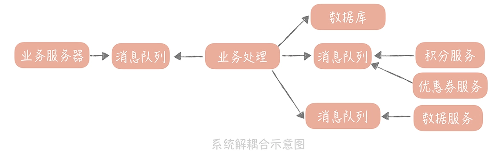

# 高并发系统设计40问

## 消息队列篇

### 17. 消息队列：秒杀



**消息队列的三大作用：**

**1. 异步处理**

简化业务流程中的步骤，提升系统性能

**2. 解耦合**

将秒杀系统和数据系统解耦开，这样两个系统的任何变更都不会影响到另一个系统

**3. 削峰填谷**

可以削去到达秒杀系统的峰值流量，让业务逻辑的处理更加缓和

**消息队列的引入的问题：**

消息是否会丢失，是否会重复？请求的延迟如何能够减少？消息接收的顺序是否会影响到业务流程的正常执行？如果消息处理流程失败了之后是否需要补发？

**秒杀超卖的处理方案：**

(1) 锁   (2) 消息队列


### 18. 消息投递: 保证消息仅仅被消息一次


**消息丢失的场景：**

- 消息从生产者写入到消息队列的过程；
- 消息在消息队列中的存储场景；
- 消息被消费者消费的过程。

**1. 在消息生产的过程中丢失消息**

原因：网络抖动

解决方案：消息重传

**2. 在消息队列中丢失消息**

原因：消息队列的机器掉电或者异常重启，pageCache没有及时写入到磁盘

解决方案：

(1) 把刷盘的间隔设置很短或者设置累积一条消息就就刷盘

(2) 建立消息队列集群

**3. 在消费的过程中存在消息丢失的可能**

消费的过程分为三步：接收消息、处理消息、更新消费进度

**保证消息被处理一次：幂等处理**

1. 通用层：每个消息生成一个唯一的id，先判断这个id是否已经存在。只处理不存在的id。id可以存储在redis或mysql中。

   ```cpp
   boolean isIDExisted = selectByID(ID); // 判断ID是否存在
   if(isIDExisted) { 
       return; //存在则直接返回
   } else { 
       process(message); //不存在，则处理消息 
       saveID(ID); //存储ID
   }
   ```

   如果消息队列有并发的情况，那么可以使用id作为redis分布式锁的key，进行加锁。

   如果防止宕机，那么可以使用mysql的事务的存储id

2. 业务层：增加版本号。具体做法是在写入消息时先查询这条消息的版本号并写入到消息中，消费消息时再与数据库中的版本号比对是否一致。


### 19. 消息队列：降低消息的延迟

**监控消息的延迟**

1. 使用工具查看消息的堆积数量。kafka使用 kafka-consumer-groups.sh 或者 JMX查看。
2. 启动一个定时任务，每隔固定时间（如1s）向消息队列生成时间戳消息。消费端处理到这种时间戳消息时，用当前消费时间减去生成时间就得到延迟时间，延迟达到一定阈值就触发报警。

**降低延迟的方法**

1. 优化消息代码提升性能

   需要权衡性能和安全的方式：消费时自动ack，把消费先拉到进程的缓冲区，然后再通过线程池里的线程进行消费。

2. 增加消费者的数量

   kafka每一个partition只能有一个消费者，所以只能通过增加partition的前提下增加消费者的数量。
